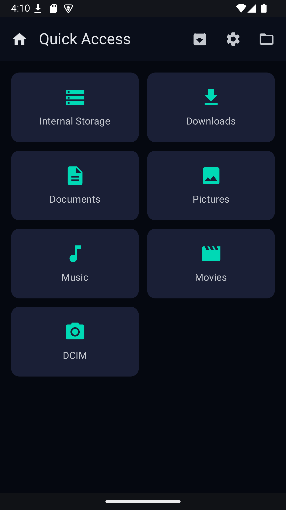
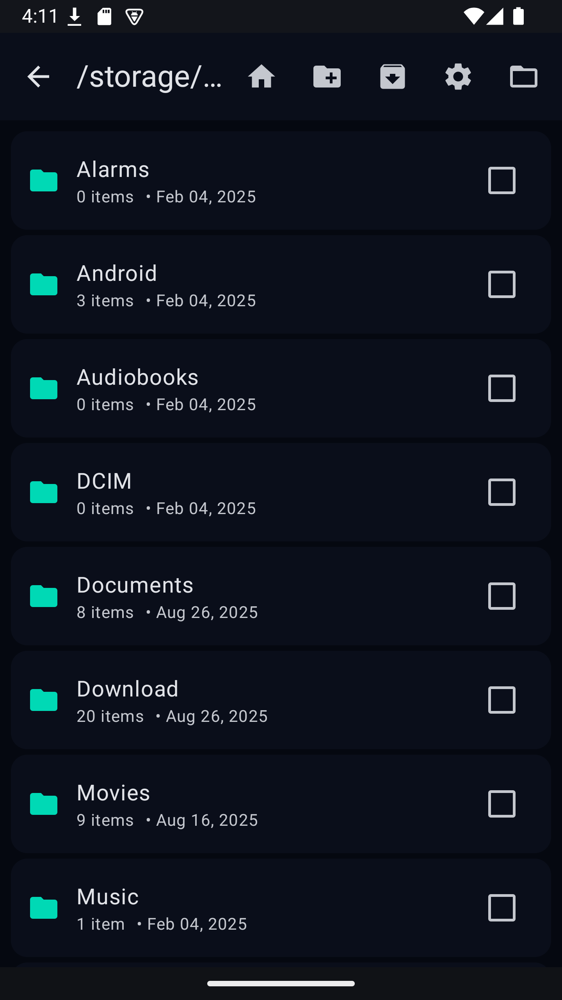
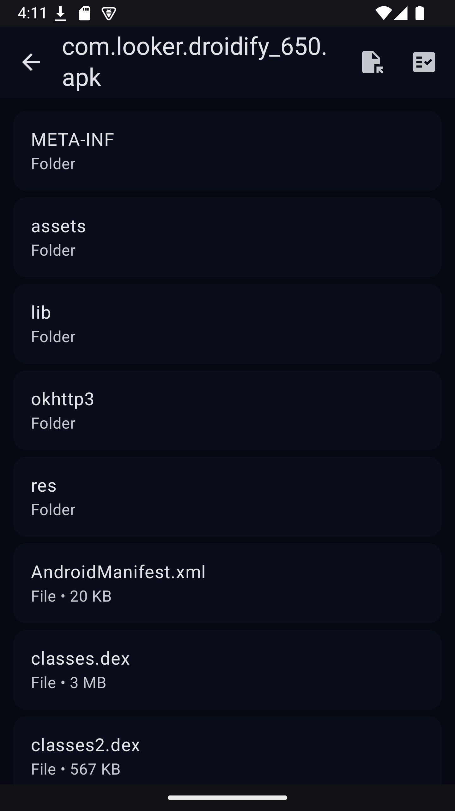
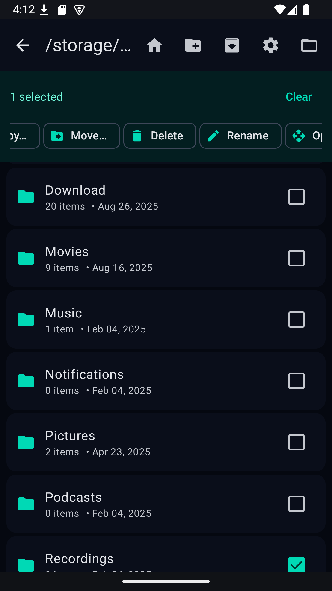

# Fluffy — Android (TV) File Manager

  
  
  
  <!--  -->

  
  <a href="https://apt.izzysoft.de/packages/app.fluffy">
    
  <!-- </a>
   -->

> UI is primarily TV‑oriented; features that don’t fit TV constraints (e.g., certain notifications) are omitted.

A fast, modern file manager with powerful archive support and an Android TV–friendly UI.

  
  
  
  

## Features
- Browse internal storage or any SAF folder
- Create ZIP/7z; extract ZIP, 7z, TAR, TGZ, TBZ2, TXZ, APK/JAR
- Encrypted archives: ZIP (AES) and 7z
- Open archives like folders; extract selected paths
- Background tasks
- Android TV layout with DPAD/keyboard support
- Compose UI, Material 3

## Permissions
- Storage / “All files” access (Android 11+): optional. SAF‑only mode works without it.

## Notes
- Path traversal is prevented during extraction.
- Large archives stream when possible; 7z listing may stage to cache.

## Contributing
Issues and PRs are welcome :)

## Installation
- Option 1: Direct APK from GitHub Releases (e.g., Downloader app on Fire TV, or a browser).
- Option 2: Share via LocalSend (or any file transfer to TV).
- Option 3: Available on GPlay Store for Android TV

## License
See [LICENSE](LICENSE).
